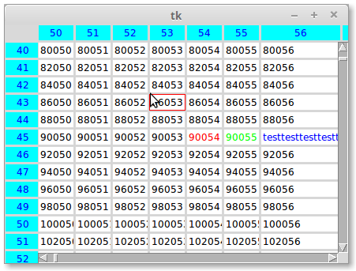

Python-Tk-TableWidget
====================================

Python-Tk-TableWidget is a Python 3 Tk widget for building and presenting data in a flexible, powerful way. It supports standard table features, like headers, columns, rows, and scrolling/resizing.

The table was designed to handle thousands of rows/columns of data without sacrificing performance. Scrolling smoothly is a first-class goal of Python-Tk-TableWidget and it's architected in a way to allow for flexibility and extensibility.

Features of Python-Tk-TableWidget:
* Fixed headers
* Performant scrolling/resizing by lazy rendering
* Handling huge amounts of data only limited by memory
* Column/row resizing
* Customizable styling - font/align/color/size
* Key-binding for easy navigation
* Jumping to a row or column

Getting started
---------------

### Demo
```bash
    python TableWidget.py
```
This result in 

### Basic Example

```python
    root = tk.Tk()
    table = TableFrame(root)
    
    table.set_data(large_data, data_rows=2000, data_cols=2000, offset_x=50, offset_y=40)
    
    table.set_table_default(bg='#ffffff', fg='#000000')
    table.set_row_default(justify="center", fg="#0000ff", bg='#00ffff')
    table.set_col_default(justify="center", fg="#0000ff", bg='#00ffff')

    table.col_header.set_col_defaults(56, width=12)
    
    table.table.set_data_attrs(45, 54, fg="#ff0000")
    table.table.set_data_attrs(45, 55, fg="#00ff00")
    table.table.set_data_attrs(45, 56, fg="#0000ff")
    table.table.set_data_value(45, 56, "testtesttesttesttest")
    
    root.mainloop()
```

How it works
------------

>1.    def set_data(self, data, data_rows=0, data_cols=0, offset_x=0, offset_y=0):
>        """set backing store for the table.
>        data format:
>        data is a list of rows, each of rows is a list of cells, each cell
>        is either a value or a dict which contains cell value and cell
>        attributes. A row or a cell could be None. The trailing Nones 
>        could be omitted for columns or rows, in which case data_rows and/
>        or data_cols should be specified. This is a trade-off for space and
>        time efficiency for daily use-cases.
>        Cell dict has the following keys which have internal keys to save
>        space for large data set:
>        keys = ['value', 'font', 'align', 'bg', 'fg', 'width', 'height',
>                'state', 'background', 'foreground', 'justify']
>        ikeys = ['v', 'ft', 'a', 'b', 'f', 'w', 'h',
>                 's', 'b', 'f', 'a']
>        Other keys supported by Entry Widget or Text Widget are transferred
>        to the cell widget. However width/height are pixels which would be
>        transformed to characters/lines for Entry Widget/Text Widget.
>        offset_x: the starting row offset to be displayed
>        offset_y: the starting column offset to be displayed
>        """
>
>2.  There are 5 default value/attributes in increasing specifc order where the later overrides the former:
>    table_default: table cell default value/attributes
>    row_default: row_header default attributes
>    col_default: col_header default attributes
>    row_defaults: row_header default attributes for specific row
>    col_defaults: col_header default attributes for specific col
>    
>    which can be set by:
>    
>    set_table_default(self, default, **kwargs) in class TableFrame
>    set_row_default(self, default, **kwargs) in class TableFrame
>    set_col_default(self, default, **kwargs) in class TableFrame
>    set_row_defaults(self, row, default, **kwargs) in class Cells
>    set_col_defaults(self, col, default, **kwargs) in class Cells
>    
>3.  There are 2 sets of APIs: one for the backing data; another for visible cell on screen
>    i.e.
>    set_attrs(self, row, col, attrs)
>    set_data_attrs(self, row, col, attrs)

Contributions
------------

Use [GitHub issues](https://github.com/michaelben/Python-Tk-TableWidget/issues) for requests.

Changelog
---------

Changes are tracked as [GitHub releases](https://github.com/michaelben/Python-Tk-TableWidget/releases).

Todos
-----
* Customize Entry Wiget to accommodate multilines and font/size change. Entry Widget only for one line and does not contain font change. Text Widget is too heavy and not compatible with Entry Widget. Need better font support from Tk.
* Editable entry
* use Tk option database for cell attributes
* Fixed and grouped columns
* layout reflow
* sorting/filting
* import/export different formats

License
-------

MIT-license
